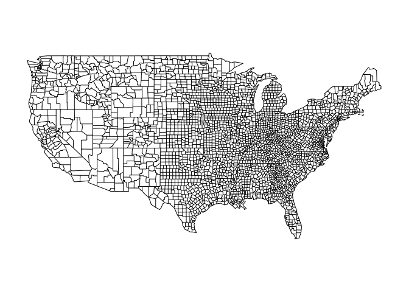
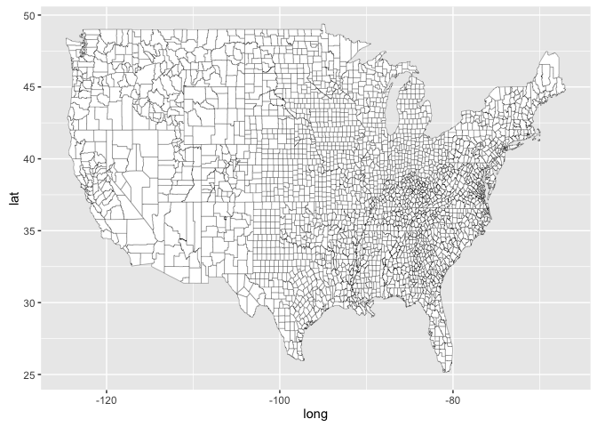
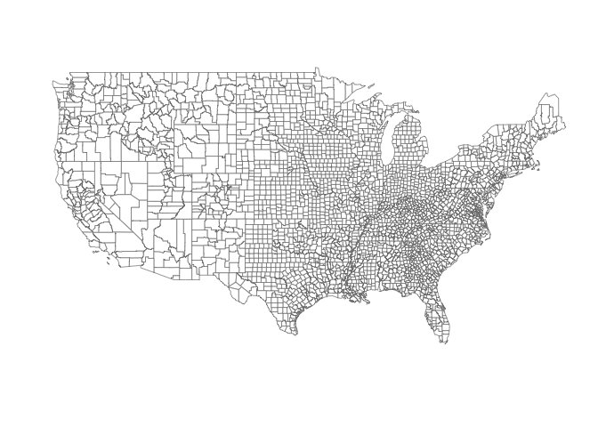
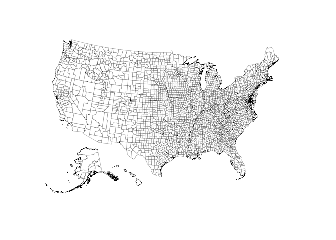
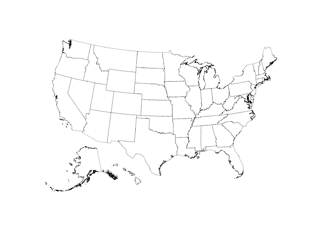

<!-- README.md is generated from README.Rmd. Please edit that file -->
About
=====

[](https://travis-ci.org/jjchern/usmapdata)

Making maps with R has been quite easy due to various [packages](https://cran.r-project.org/web/views/Spatial.html). For example, the `maps` package has a function that directly plots US counties:

``` r
library(maps)
map("county")
```



Or use the above data but plot it with `ggplot2`:

``` r
library(ggplot2)
map_data("county") -> map_data_county
ggplot() +
  geom_map(data = map_data_county, map = map_data_county,
           aes(x = long, y = lat, map_id = region),
           color="black", fill="white", size=0.1)
```



Or with `ggcounty`:

``` r
# devtools::install_github("hrbrmstr/ggcounty")
library(ggcounty)
ggcounty.us() -> us
us$gg
```



The problem with these maps, however, is that Alaska and Hawaii are often missing. Moving these two states into a US map involves rotating, shrinking, and shifting the corresponding spatial polygons.

The `usmapdata` package intends to solve this problem by providing tidy data frames that have Alaska and Hawaii in proper place, following the procedure documented nicely in [a blog post by Bob Rudis](rud.is/b/2014/11/16/moving-the-earth-well-alaska-hawaii-with-r/).

Installation
============

``` r
# install.packages("devtools")
devtools::install_github("jjchern/usmapdata")
```

Usage
=====

Plain County Map
----------------

Aftering installing the package, one can get, say, the US county data with `usmapdata::county`. For example, the following chuck of code plots a county map with `ggplot2`:

``` r
library(ggplot2)
ggplot() +
  geom_map(data = usmapdata::county, map = usmapdata::county,
           aes(x = long, y = lat, map_id = id),
           color="black", fill="white", size=0.1) +
  coord_map("albers", lat0 = 30, lat1 = 40) +
  ggthemes::theme_map()
```



Plain state Map
---------------

``` r
library(ggplot2)
ggplot() +
  geom_map(data = usmapdata::state, map = usmapdata::state,
           aes(x = long, y = lat, map_id = id),
           color="black", fill="white", size=0.1) +
  coord_map("albers", lat0 = 30, lat1 = 40) +
  ggthemes::theme_map()
```


